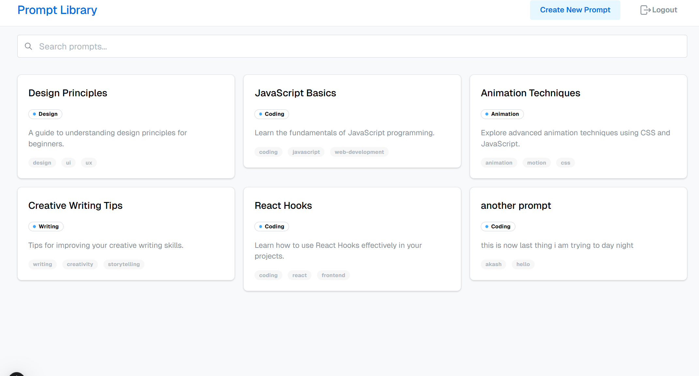

# Prompt Library

A web application for creating, storing, and managing AI prompts. Built with Next.js, TypeScript, and Mantine UI.

 <!-- You may want to add an actual screenshot image later -->

## Features

- User authentication
- Create, read, update, and delete prompts
- Responsive design built with Mantine UI components
- TypeScript for type safety
- Tailwind CSS for styling

## Getting Started

### Prerequisites

- Node.js 18.x or higher
- npm or yarn

### Installation

1. Clone the repository:
   ```bash
   git clone https://github.com/yourusername/prompt-library.git
   cd prompt-library
   ```

2. Install dependencies:
   ```bash
   npm install
   # or
   yarn install
   ```

3. Set up environment variables:
   Create a `.env.local` file in the root directory with the following variables:
   ```
   MONGODB_URI=your_mongodb_connection_string
   JWT_SECRET=your_jwt_secret_key
   ```

4. Run the development server:
   ```bash
   npm run dev
   # or
   yarn dev
   ```

5. Open [http://localhost:3000](http://localhost:3000) with your browser to see the application.

## Project Structure

```
app/
  components/        # Reusable UI components
    auth/            # Authentication related components
    prompts/         # Prompt management components
  lib/               # Utility functions and API services
  prompts/           # Prompt-related pages
    [id]/            # View/delete specific prompt
    edit/[id]/       # Edit specific prompt
    new/             # Create new prompt
  page.tsx           # Main application page
```

## Contributing

We welcome contributions to the Prompt Library! Here's how you can contribute:

### Setting Up the Development Environment

1. Fork the repository
2. Clone your fork:
   ```bash
   git clone https://github.com/your-username/prompt-library.git
   cd prompt-library
   ```
3. Create a new branch:
   ```bash
   git checkout -b feature/your-feature-name
   ```
4. Make your changes and commit them:
   ```bash
   git commit -m "Add your descriptive commit message"
   ```
5. Push to your fork:
   ```bash
   git push origin feature/your-feature-name
   ```
6. Create a Pull Request from your fork to the main repository

### Contribution Guidelines

- **Code Style**: Follow the existing code style and formatting
- **TypeScript**: Use proper TypeScript types for all new code
- **Testing**: Add tests for new features when possible
- **Documentation**: Update documentation for any changes to the API or features
- **Commit Messages**: Use clear, descriptive commit messages
- **Pull Requests**: Keep PRs focused on a single feature or bug fix

### Code Review Process

1. All submissions require review before being merged
2. Feedback may be given for improvements or changes
3. Once approved, your changes will be merged into the main branch

### Issue Reporting

If you find a bug or want to request a new feature:

1. Check existing issues to avoid duplicates
2. Open a new issue with a clear title and detailed description
3. For bugs, include steps to reproduce, expected behavior, and actual behavior

## License

This project is licensed under the MIT License - see the LICENSE file for details.

## Acknowledgments

- [Next.js](https://nextjs.org/) - The React framework
- [Mantine UI](https://mantine.dev/) - UI component library
- [TailwindCSS](https://tailwindcss.com/) - CSS framework
